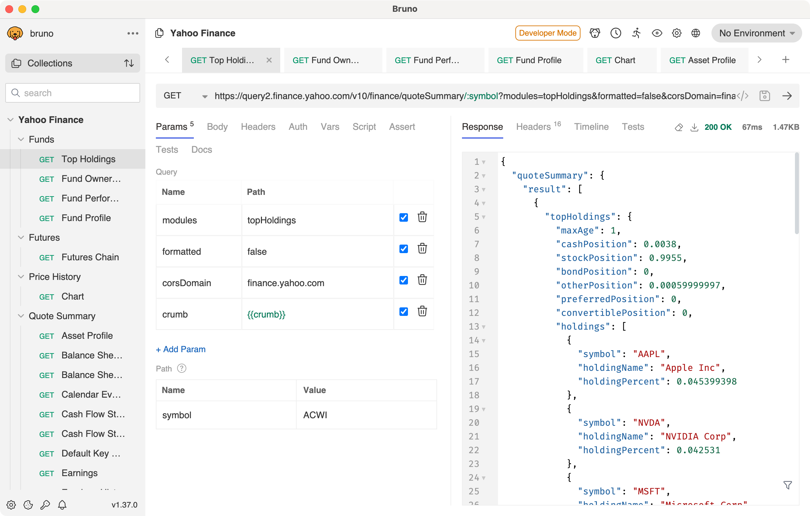

# Bruno Collection for Yahoo Finance

This repository contains a [Bruno](https://www.usebruno.com/) collection for interacting with Yahoo Finance's public API endpoints. Although Yahoo Finance discontinued their official API documentation in 2017, these endpoints remain publicly accessible and functional.



## Prerequisites

- Install [Bruno](https://www.usebruno.com/downloads).
- Git (optional, for cloning this repository).

## Setup

1. Clone this repository:

```bash
git clone https://github.com/gzurowski/bruno-yahoo-finance.git
```

Alternatively, you can download the collection as a [ZIP file](https://github.com/gzurowski/bruno-yahoo-finance/archive/refs/heads/main.zip).

2. Open the `bruno-yahoo-finance` folder in Bruno.
3. Click on _Open Collection_.
4. Navigate to the cloned repository folder and click _Open_.

## Authentication

Before making any requests to the actual API endpoints, you need to obtain a security token.

1. Run the _Get Cookies_ request to obtain session cookies. Note that this will return a HTTP 404 error and a corresponding error page which is expected. The cookies are nevertheless stored in Bruno's cookie store and will be used by subsequent requests.
2. Copy the _Get Crumb_ request to obtain a security token.
3. Now you can run any other request in the collection.

## Notes

- The endpoints are not officially documented and are subject to change.
- Rate limiting may apply.
